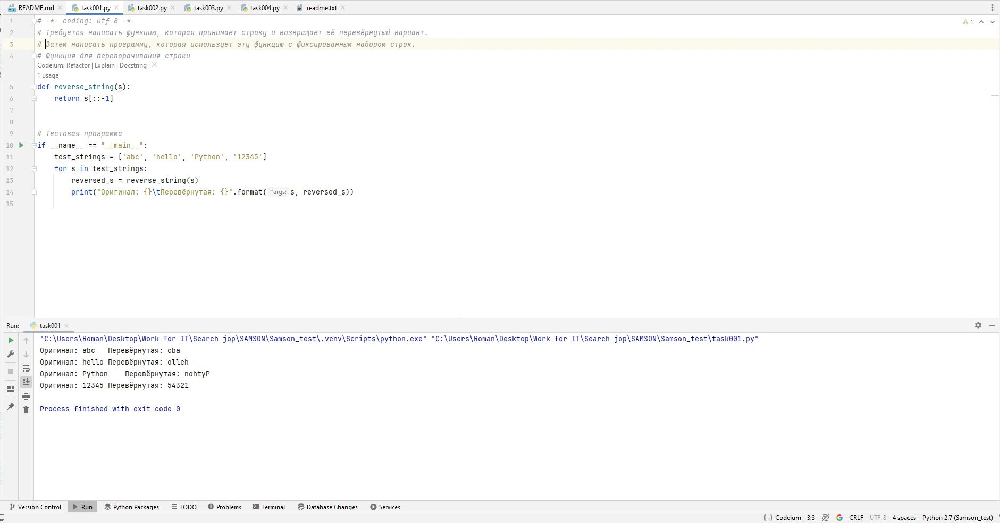
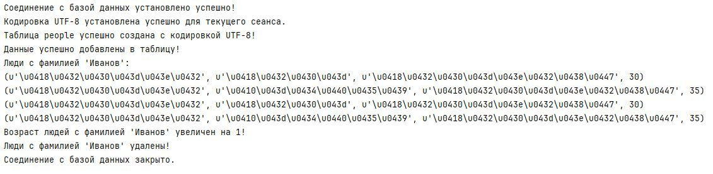
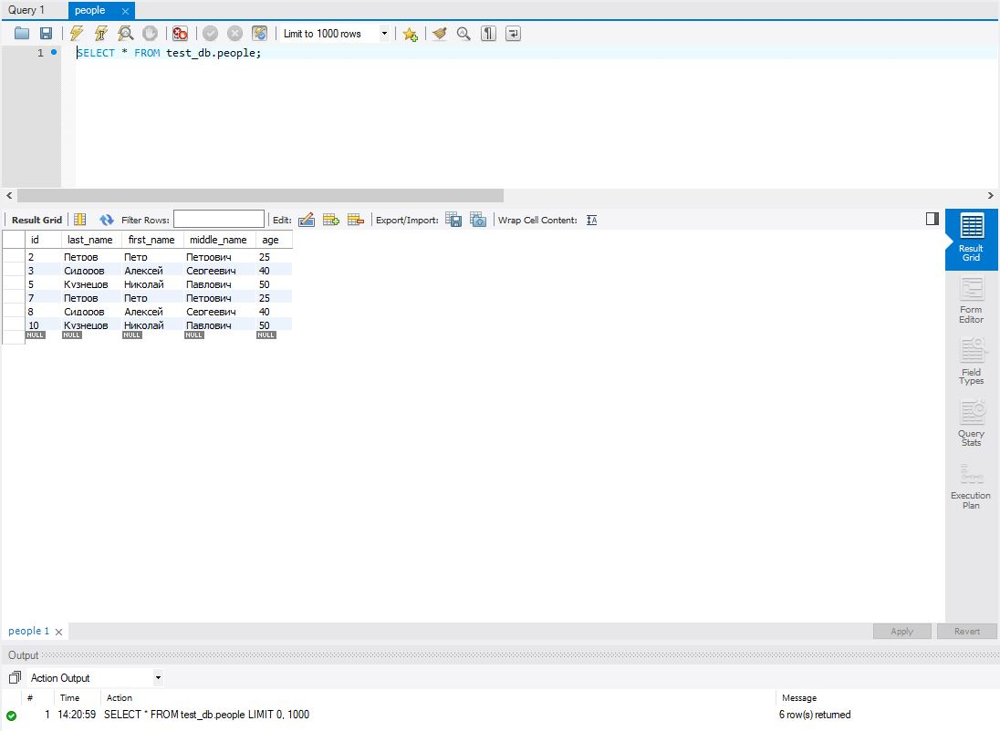

# Тестовое задание от Samson

## ТЗ

1. На минимальное знание python: Написать функцию, получающую параметр строку и возвращающую
"перевёрнутую" строку, например 'abc' -> 'cba'. Написать программу, использующую эту функцию. 
В тестирующей программе достаточно просто фиксированного
набора обрабатываемых строк.

2. На минимальное владение Qt: Написать программу, которая будет
использовать форму для ввода исходной стороки и выводить перевёрнутую. Необходимо использовать
функцию, написанную для задачи 1.

3. На дальнейшее овладение Qt (тема - модель-представление): написать
программу, использующую QTableView и класс производный от QAbstractTableModel для
формирования таблицы умножения. достаточно небольшой таблички, 10x10. Достоинством программы
считается "расцвечивание" ячеек (цветом, начертанием шрифта, выравниванием) в зависимости от
свойств чисел - чётности, величины остатка деления на некоторое число и т.п.

4. На минимальное владение SQL: написать запросы:

4.1. Создать таблицу c описанием простейшего списка людей - фамилия,
имя, отчество, возраст.

4.2. Заполнить эту таблицу 5-10 записями.

4.3. Выбрать людей с заданной фамилией

4.4. Увеличить возраст на 1 для людей с заданной фамилией

4.5. Удалить записи с заданной фамилией

Как видно, это довольно сложные задания для людей впервые сталкивающихся
с python, Qt и SQL и
простые для тех кто уже немного знаком. Хотя, конечно, эти задания
ничтожны по сравнению с
реальными задачами. Формулировки задач несколько "неряшливы", оценки
будут субъективны.

Замечания по поводу версий ПО:

1. Мы используем python 2.5 и в принципе всё должно работать в python
2.6 или 2.7. python 3 довольно сильно отличается от python 2 и нами пока не применяется.
Оф.сайт: www.python.org
2. Мы используем Qt версии 4.5.3 под windows и Qt 4.5.3 и выше под
linux. Qt 4.6 или 4.7 тоже должно быть применимо. 
Оф.сайт: http://www.qtsoftware.com
3. Мы используем PyQt версии 4.5.x. Обычно более новые версии тоже
применимы. 
Оф.сайт: http://www.riverbankcomputing.com
4. Мы используем MySQL 5.0.x, 5.1.x должно быть применимо, но 
ограниченный опыт показал проблемы в 5.1.34
Оф.сайт: www.mysql.com. 
5. Для разработки мы предпочитаем использовать IDE Eric4
    (http://eric-ide.python-projects.org/eric4-download.html)

## Решение:

1. На минимальное знание python: Написать функцию, получающую параметр строку и возвращающую
"перевёрнутую" строку, например 'abc' -> 'cba'. Написать программу, использующую эту функцию. 
В тестирующей программе достаточно просто фиксированного
набора обрабатываемых строк.

2. На минимальное владение Qt: Написать программу, которая будет
использовать форму для ввода исходной стороки и выводить перевёрнутую. Необходимо использовать
функцию, написанную для задачи 1.

Для проверки работы данной программы, необходим sip старой версии, например:
sip-4.19.x-cp27-none-win_amd64.whl 
на просторах интернета не удалось его найти, в доступе есть только версии с поддержкой python 3.Х.

3. На дальнейшее овладение Qt (тема - модель-представление): написать
программу, использующую QTableView и класс производный от QAbstractTableModel для
формирования таблицы умножения. достаточно небольшой таблички, 10x10. Достоинством программы
считается "расцвечивание" ячеек (цветом, начертанием шрифта, выравниванием) в зависимости от
свойств чисел - чётности, величины остатка деления на некоторое число и т.п.

Для проверки работы данной программы, необходим sip старой версии, например:
sip-4.19.x-cp27-none-win_amd64.whl 
на просторах интернета не удалось его найти, в доступе есть только версии с поддержкой python 3.Х.

4. На минимальное владение SQL: написать запросы:

4.1. Создать таблицу c описанием простейшего списка людей - фамилия,
имя, отчество, возраст.

4.2. Заполнить эту таблицу 5-10 записями.

4.3. Выбрать людей с заданной фамилией

4.4. Увеличить возраст на 1 для людей с заданной фамилией

4.5. Удалить записи с заданной фамилией

Использовал MySQL 5.1.30 и workbench, еще модуль PyMySQL==0.10.1 для запуска скрипта, его 
можно установить из requirements.txt. 
Альтернативный способ протестировать задание 4, скопировать запросы из скрипта в workbench,
выполнить и проверить.

5. Для разработки использовал IDE pycharm 2024.1.6(eric4 где-то глубоко закопан в архивах).